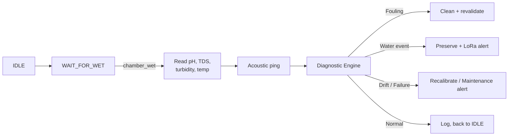

# Water Twin — Rural Water Sampling & Quality Monitoring

An ESP32-based edge system that tells the difference between **dirty water** and a **dirty sensor**, then acts on it: cleans itself when it's fouled, preserves the sample and alerts when the water is actually contaminated. Built for rural / off-grid deployment with no cellular dependency.

S5 CSE Microcontrollers project, College of Engineering Trivandrum (KTU 2024 scheme).

## The problem

Cheap water-quality probes left submerged foul quickly — biofilm and mineral buildup make dirty sensors look exactly like dirty water. Most low-cost monitors either clean on a blind timer (wasteful, or too late) or don't clean at all (drifting readings, false alarms). Water Twin instead cross-checks multiple signals on each read and decides which situation it's actually looking at.

## How it works

1. The sensors sit in a small sidecar chamber plumbed into the tank — no valve, no pump. Its water level simply mirrors the tank's: when the tank has water, the chamber does too, and when the tank drains, the chamber drains with it. The central controller waits in `WAIT_FOR_WET` for that to be true before it does anything else.
2. Once wet, four sensors read the sample: pH, TDS (conductivity/salinity proxy), turbidity (custom LED + photoresistor), and temperature (DS18B20, used to contextualize the other three).
3. A 40 kHz ultrasonic transducer is "pinged," and an LM358-based receive circuit times how fast the ringing decays. Faster decay means more biofilm on the chamber walls — physical evidence of fouling, independent of the water chemistry.
4. An on-device diagnostic engine combines all of this into one of six states: `NORMAL`, `WATER_EVENT`, `SENSOR_DRIFT`, `SENSOR_FOULING`, `SENSOR_FAILURE`, or `UNKNOWN`. When the chamber is dry, none of this runs — the system just sleeps until the tank refills.
5. A decision engine maps that diagnosis to an action:
   - **Fouling** → drive the same transducer hard to cavitate the chamber clean, then resample to confirm recovery. It re-checks that the chamber is still wet immediately before firing — the tank can drain mid-cycle without warning.
   - **Water event** → skip cleaning, preserve the sample, and send an alert over LoRa (no cellular network needed).
   - **Drift** → flag the sensor for recalibration.
   - **Failure** → raise a maintenance alert.
   - **Low confidence** → resample rather than guess.



## Hardware

| Component | Part | Role |
| --- | --- | --- |
| MCU | ESP32-S3 | Runs sampling, sensing, diagnosis, and radio |
| pH | Analog pH probe module | Acidity/alkalinity |
| Conductivity | Analog TDS module, 0–1000 ppm | Dissolved salts |
| Turbidity | Custom LED + LDR (dark-subtracted) | Cloudiness |
| Temperature | DS18B20 | Compensation for pH/TDS; own failure mode |
| ADC | ADS1115 (16-bit, 4-channel) | Clean analog reads for pH, TDS, turbidity |
| Cleaning/sensing | 40 kHz 60 W ultrasonic transducer | Ring-down timing (fouling) + ultrasonic cleaning |
| Receive amp | LM358 | Envelope/ring-down detection on the piezo signal |
| Radio | SX1278 LoRa module, 433 MHz + antenna | Long-range, no-cellular alerting |
| Power | 12 V in via DC jack, 2× LM2596 buck converters | 5 V / 3.3 V rails |
| Sampling | Passive sidecar chamber, plumbed to the tank | No valve or pump — chamber level mirrors the tank directly |

**Not yet in the build:** the ultrasonic driver board for the transducer, a 12 V SMPS supply, and — pending Task 5's chamber-presence experiment — possibly a dedicated wet/dry sensor if TDS/turbidity alone can't detect it reliably.

## Repository Structure & Getting Started

The repository maps directly to the five team tasks. Firmware is hardware-independent and unit-tested on a PC using mocks before flashing to the ESP32-S3 via ESP-IDF.

```text
core_application_sampling_controller/   (Task 1: C++, state machine & config)
signal_processing_feature_engine/       (Task 2: C++, filters & features)
intelligence_diagnostic_engine/         (Task 3: C++, decision core)
ESP32_HW_abstraction_drivers/           (Task 4: C++, ESP-IDF drivers & mocks)
experiments_datasets_ML/                (Task 5: Python, research & datasets)
tasks_desc/                             (Detailed task specifications)
```

- **Firmware (Tasks 1-4):** Develop locally using `g++` against mocks (e.g. `./run_mvp`). Final target: ESP-IDF.
- **Data (Task 5):** Python (`numpy`, `pandas`, `scipy`, `scikit-learn`, `matplotlib`).
- **To start:** Read your assignment in `tasks_desc/` and build your module in your folder.

## Team task breakdown

- **Task 1 — Core Application**: Central state machine (`IDLE → WAIT_FOR_WET → MEASUREMENT → ...`).
- **Task 2 — Signal Processing**: Turns raw readings into a validated `FeatureSet`.
- **Task 3 — Intelligence**: Decision core. ([Full spec](tasks_desc/TEAM_TASK_3_Intelligence_Diagnostic_Engine.md)).
- **Task 4 — Hardware Abstraction**: GPIO/ADC drivers and mock hardware.
- **Task 5 — Experiments & ML**: Python dataset and experiment pipeline.

## Status

- ✅ Sensor selection and procurement (see hardware table)
- ✅ Diagnostic/decision logic spec (Task 3 v2)
- ✅ Team task specs updated for the passive sidecar + TDS hardware (Tasks 1, 2, 4, 5 v2)
- ⬜ Chamber wet/dry detection threshold (Task 5 experiment, feeds Task 4)
- ⬜ Ultrasonic driver board for the transducer
- ⬜ Firmware implementation + PC-side test harness
- ⬜ Field calibration of thresholds in `config.h`

## Open questions

- TDS module model number (pending, affects calibration only).
- Who owns temperature compensation for pH/TDS — upstream sensor driver or the intelligence layer?
- Ring-down clean baseline: must be measured with the chamber in the same fill state every cycle.
- Chamber wet/dry detection: can TDS/turbidity alone tell wet from dry reliably, or is a dedicated presence sensor needed? (Task 5, Dataset E)
