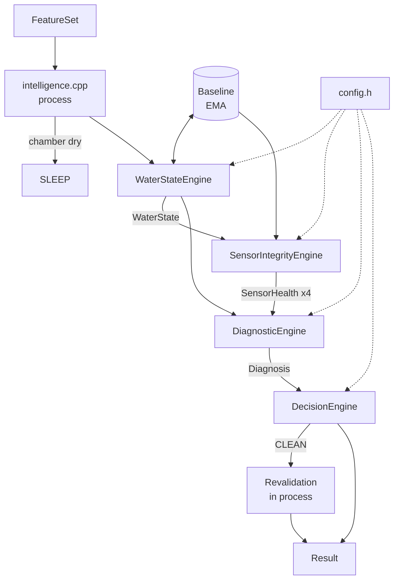

# Task 3 — Intelligence & Diagnostic Engine: Summary

## 1. Overall solution

Water Twin is an ESP32-S3 water monitor for off-grid tanks that tells a dirty sensor apart from dirty water. Sensors sit in a passive sidecar chamber whose water level mirrors the tank. Each cycle they read pH, TDS, turbidity and temperature, and an ultrasonic ping measures biofilm on the chamber walls. The system then acts: it cleans itself when fouled, preserves the sample and sends a LoRa alert when the water is contaminated, flags drifting sensors for recalibration, and raises maintenance alerts for broken parts.

## 2. What this module does

Upstream code gives this module one `FeatureSet` per cycle: readings already in physical units. `process()` returns four things. First, whether the water is abnormal, judged by several chemistry sensors moving off their baselines together. Second, a health score for each sensor, which drops slowly from drift and noise or immediately on a hard failure signature. Third, a diagnosis (NORMAL, WATER_EVENT, SENSOR_FOULING, SENSOR_DRIFT, SENSOR_FAILURE or UNKNOWN), which counts only after it repeats on 2 cycles. Fourth, a decision such as SLEEP, CLEAN or PRESERVE_SAMPLE_AND_ALERT. Cleaning is blocked during a water event, when the chamber is dry, and beyond 3 cleans a day. After each clean the module checks whether the sensor actually recovered. When the chamber is dry the module skips everything and returns SLEEP. The module is pure C++ with no hardware includes, and it is tested on a PC with g++.

## 3. Sensors and assumptions

The sensors are an analog pH probe, an analog TDS probe (0–1000 ppm), an LED + LDR turbidity sensor that subtracts a dark reading, a DS18B20 temperature probe, and a 40 kHz transducer whose ring-down time is measured by an LM358 circuit (a shorter ring-down means more biofilm). The module assumes:

- Upstream already temperature-compensates pH and TDS to 25 °C.
- Upstream supplies raw LDR lit/dark counts.
- Temperature is context only and never votes on whether the water is abnormal.
- A TDS reading of 990 ppm or more is saturated.
- The first valid ring-down comes from a clean chamber and becomes the clean baseline.
- The day is taken from `timestamp_ms`.
- Every threshold in `config.h` is a placeholder until field calibration.

## 4. Files

- **`types.h`**: the shared contract. It holds `FeatureSet`, `WaterState`, `SensorHealth`, `Diagnosis`, `Result`, the `SensorId`, `DiagnosisType` and `Decision` enums, and the `process()` declaration. Every other team codes against this file.
- **`config.h`**: every threshold and weight as a named constant, grouped by engine. This is the only file that changes during calibration.
- **`baseline.h`**: an exponential moving average (EMA) of mean and variance with a z-score helper. It gives each sensor its idea of "normal" and stops updating while the water is abnormal.
- **`water_state_engine.{h,cpp}`**: scores pH, TDS and turbidity against their baselines. It produces the anomaly score, confidence and abnormal flag, leaves out sensors that are invalid or unhealthy, caps saturated TDS, and halves confidence when temperature jumps.
- **`sensor_integrity_engine.{h,cpp}`**: tracks each sensor's drift score (counted only when it moves alone), noise score and smoothed health. It also checks hard failure signatures: DS18B20 reading −127 or 85, pH pinned at a rail or flat, TDS near 0 or flat, LED dead or light leaking, and ring-down near 0.
- **`diagnostic_engine.{h,cpp}`**: applies the diagnosis rules in a fixed order, records evidence and confidence, and holds back a diagnosis until it repeats `N_CONFIRM` times.
- **`decision_engine.{h,cpp}`**: maps each diagnosis to an action. It returns RESAMPLE when confidence is low, escalates repeated UNKNOWNs to MAINTENANCE_ALERT, and applies the guards on CLEAN.
- **`intelligence.{h,cpp}`**: holds all state that carries between cycles and implements `process()`. It handles the dry-chamber skip, ignores the ultrasonic reading on the cycle after a clean, and checks recovery after cleaning.
- **`test_intelligence.cpp`**: the PC test harness with 16 synthetic sequences covering the spec's 13 test cases plus the cleaning guards. Run it with `g++ -std=c++17 -I. *.cpp -o test && ./test`.

## 5. Components

