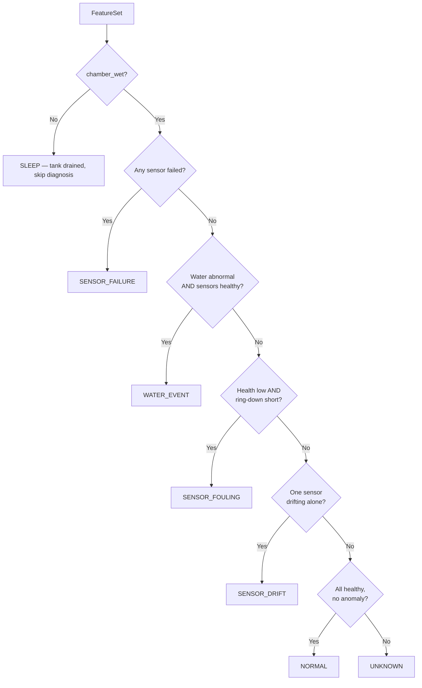

# Team Task 3 — Intelligence & Diagnostic Engine (v2)

Sep 25, 2026 · @Jas Tan

The job is unchanged: answer two separate questions each cycle — is the water abnormal, and is a sensor abnormal — then pick an action. This version rewrites the inputs, rules and tests for the parts actually bought.

## What changed

Five hardware changes affect this layer; the rest (LoRa band, power rails) do not, because this layer never touches hardware.

| Area | Original task | Now | Effect on this layer |
| --- | --- | --- | --- |
| Conductivity | EC probe (µS/cm) | Analog TDS probe, 0–1000 ppm | Field is `tds_ppm`; readings at 1000 ppm are clipped, not trusted |
| Temperature | Referenced in rules, no sensor | DS18B20 probe | Real input: context for pH/TDS and its own failure codes |
| Turbidity | Optical module | Custom LED + LDR, dark-subtracted | Lens film looks like cloudy water; ambient light and LED ageing cause drift |
| Acoustic | "Eventually", small disc | 40 kHz 60 W transducer, LM358 ring-down timing | Ring-down time in µs; shorter = more damping = biofilm |
| Sampling mechanism | EC spike after valve opens | None — passive sidecar; chamber level always mirrors the tank | No `fill_ok`/`fill_time_ms`; gate reads on `chamber_wet` — a dry chamber (tank drained) is expected, not a failure |

There's no solenoid valve or pump: the sampling chamber is a passive sidecar plumbed into the tank, so its water level simply mirrors the tank's. Sensors read while the chamber is wet; when the tank drains, the chamber drains with it and reads stop until it refills. `fill_ok`/`fill_time_ms` from the original design are replaced by `chamber_wet`.

Sensor model numbers for the TDS/EC module are still pending and only affect upstream calibration, not this layer.

## Inputs and outputs

The feature-extraction team hands over one `FeatureSet` per cycle, already in physical units. pH and TDS arrive temperature-compensated to 25 °C; raw values ride along for debugging.

```cpp
enum class SensorId { PH, TDS, TURBIDITY, TEMP, COUNT };

struct FeatureSet {
    uint32_t timestamp_ms;

    float ph;              // compensated, 0-14
    float tds_ppm;         // compensated, 0-1000
    float turbidity;       // 0-1 attenuation = 1 - (lit - dark) / clear_ref
    float temp_c;          // DS18B20

    float noise[4];        // std-dev within this cycle's sample burst, per SensorId
    bool  valid[4];        // false = upstream read error for that sensor

    bool  chamber_wet;     // sidecar currently holds water (mirrors the tank; no valve)
    float wet_duration_ms; // how long it's been continuously wet, for staleness checks

    bool  acoustic_valid;  // false while the ping circuit doesn't exist, chamber is dry, or during cleaning
    float ringdown_us;     // time LM358 envelope stays above threshold
};
```

Outputs, in the order they are computed:

```cpp
struct WaterState   { float anomaly_score, confidence; bool abnormal; };
struct SensorHealth { float health_score, drift_score, noise_score, confidence; bool failed; };

enum class DiagnosisType { NORMAL, WATER_EVENT, SENSOR_FOULING, SENSOR_DRIFT,
                           SENSOR_FAILURE, UNKNOWN };

enum class Decision { SLEEP, PRESERVE_SAMPLE_AND_ALERT, CLEAN, RECALIBRATE,
                      MAINTENANCE_ALERT, RESAMPLE };

struct Diagnosis {
    DiagnosisType type;
    SensorId      suspect;          // which sensor, for DRIFT / FOULING / FAILURE
    float         confidence;
    float         ev_water, ev_degradation, ev_temporal, ev_cross_sensor, ev_acoustic;
    uint32_t      timestamp_ms;
};

struct Result { WaterState water; SensorHealth health[4]; Diagnosis diagnosis; Decision decision; };
Result process(const FeatureSet&);   // the only call the hardware team makes
```

Module layout (two files added to the original four):

```
firmware/intelligence/
├── types.h                      // structs + enums above
├── config.h                     // every threshold as a named constant
├── baseline.{h,cpp}             // per-sensor EMA mean/variance
├── water_state_engine.{h,cpp}
├── sensor_integrity_engine.{h,cpp}
├── diagnostic_engine.{h,cpp}
└── decision_engine.{h,cpp}
```

## Water State Engine

The water is abnormal when several chemistry signals move away from their baseline together. It uses pH, TDS and turbidity; temperature is context, not a vote.

1. For each of pH, TDS and turbidity, compute a z-score against the baseline (slow EMA mean and variance, `baseline.cpp`).
2. Count how many exceed `Z_DEV` (placeholder 3.0). Combine agreement and magnitude: `raw = mean(|z|) × (agreeing / 3)`, then `anomaly_score = sigmoid(raw − Z_MID)`.
3. `abnormal = anomaly_score > WATER_ABNORMAL` (placeholder 0.7).
4. Confidence rises with the number of agreeing, valid, healthy sensors: one sensor alone caps it at 0.4.
5. Skip a sensor whose `valid` is false or whose health is below 0.4, and say so in the evidence.

Temperature rules:

- If `temp_c` jumped more than `TEMP_JUMP` (placeholder 3 °C) since the last cycle, halve confidence. A residual pH/TDS shift may just be imperfect compensation.
- Temperature never raises the anomaly score by itself.

Baseline rules:

- Freeze baseline updates while `abnormal` is true, so a contamination event never becomes the new normal.
- Reset the turbidity baseline after each confirmed clean, because the LED/LDR clear reference changes when the window is wiped.
- Treat a TDS reading ≥ 990 ppm as saturated: it counts as "high" but its z-score is capped, since the true value is unknown.

## Sensor Integrity Engine

Health is tracked separately for each of the four sensors, and changes slowly: one bad reading never marks a sensor broken.

- **Drift score:** gap between the sensor's short EMA and its long reference mean, counted only while the other chemistry sensors stay inside their baseline. A sensor moving alone is drifting; all moving together is water.
- **Noise score:** this cycle's `noise[i]` divided by the sensor's usual noise.
- **Health:** `1 − (W_DRIFT·drift + W_NOISE·noise)`, clamped to 0–1, then smoothed over `HEALTH_WINDOW` cycles (placeholder 5).
- **Failed:** set immediately, without smoothing, when a hard signature below is seen on `FAIL_CONFIRM` consecutive cycles (placeholder 2).

Hard failure signatures for the parts bought (upstream passes the raw flags these need):

| Sensor | Signature | Likely cause |
| --- | --- | --- |
| DS18B20 | Reads −127 °C | Probe disconnected |
| DS18B20 | Reads exactly 85 °C | Read before conversion finished, or power fault |
| pH module | Pinned near 0 or 14, or near-zero noise for many cycles | Probe dry, cracked or unplugged |
| TDS probe | \~0 ppm while `chamber_wet` is true, and was true on earlier cycles too | Probe disconnected |
| TDS probe | Reads pinned (near-zero variance) regardless of wet/dry state | Probe fouled, shorted, or miswired |
| LED + LDR | Lit reading ≈ dark reading | LED dead |
| LED + LDR | Dark reading well above its baseline | Light leak into the chamber |
| Transducer + LM358 | `ringdown_us` ≈ 0 with `acoustic_valid` true | Driver, amplifier or wiring fault |

Turbidity note: a film on the LED/LDR windows looks exactly like cloudy water. Turbidity rising alone, with pH and TDS steady, is a fouling suspect first and a water event second.

## Diagnosis

Rules run in a fixed order and the first match wins. A diagnosis is only committed after it repeats on `N_CONFIRM` consecutive cycles (placeholder 2); until then the output is UNKNOWN.

A dry chamber is not diagnosed: when `chamber_wet` is false, `process()` logs the state and returns SLEEP without running the rules below. There's no valve to fault on and no fill timeout — dryness just means the tank has drained. Diagnosis resumes on the next wet cycle.



"Ring-down short" means `ringdown_us < RINGDOWN_CLEAN_BASELINE × (1 − DAMP_FRAC)` (placeholder 0.25). With `acoustic_valid` false, the fouling rule cannot fire: a sensor that fits it is reported as SENSOR\_DRIFT with confidence capped at 0.6.

Updated example cases:

| Case | Readings | Diagnosis |
| --- | --- | --- |
| 1 | pH, TDS and turbidity all shift; temperature stable; health good | WATER\_EVENT |
| 2 | pH shifts alone; TDS, turbidity, temperature stable; pH health falling; ring-down normal | SENSOR\_DRIFT (pH) |
| 3 | Turbidity rises alone; ring-down 30% shorter than after last clean | SENSOR\_FOULING (turbidity window) |
| 4 | pH abnormal, pH health poor, ring-down short | SENSOR\_FOULING (pH) |
| 5 | Temperature jumps 6 °C; pH and TDS shift slightly | NORMAL or UNKNOWN, never WATER\_EVENT on this alone |
| 6 | DS18B20 reads −127 | SENSOR\_FAILURE (temperature) |
| 7 | TDS at 1000 ppm, pH shifted, turbidity up | WATER\_EVENT, with TDS marked saturated in evidence |
| 8 | Readings contradict each other with no pattern | UNKNOWN — never forced |
| 9 | Chamber reads dry (chamber\_wet = false) while tank is draining | No diagnosis — SLEEP; resume once chamber\_wet is true |

## Decision Engine

Below `CONF_ACT` (placeholder 0.6) the decision is always RESAMPLE. Above it, each diagnosis maps to one action:

| Diagnosis | Decision | Notes |
| --- | --- | --- |
| NORMAL | SLEEP | Log, drain, wait for next cycle |
| WATER\_EVENT | PRESERVE\_SAMPLE\_AND\_ALERT | Keep chamber full, send LoRa alert |
| SENSOR\_FOULING | CLEAN | Only if every guard below passes |
| SENSOR\_DRIFT | RECALIBRATE | Flag the named sensor; keep reporting its readings as low-trust |
| SENSOR\_FAILURE | MAINTENANCE\_ALERT | Name the sensor; a dry chamber is handled by the guard above and is never itself a failure |
| UNKNOWN | RESAMPLE | After `MAX_RESAMPLE` (placeholder 3) in a row, send MAINTENANCE\_ALERT |

Hard guards, checked in code after the lookup and never overridden:

1. Never CLEAN while `water.abnormal` is true or a WATER\_EVENT is pending confirmation.
2. Never CLEAN unless `chamber_wet` is true: the transducer must be submerged to cavitate, and running it dry can damage it. Because the chamber can drain at any moment as the tank empties, re-check `chamber_wet` immediately before driving the transducer, not just at the start of the cycle.
3. At most `MAX_CLEANS_PER_DAY` (placeholder 3); beyond that, MAINTENANCE\_ALERT instead.
4. Set `acoustic_valid` false for the cycle after a clean is commanded, so cleaning noise never reads as a ring-down.

## Confidence and revalidation

Confidence is the mean strength of the conditions that fired, each scaled 0–1, and every one is stored in the Diagnosis as evidence. Acoustic evidence now has its own field.

```
SENSOR_FOULING (turbidity)   confidence = 0.86
  water anomaly        = 0.22
  sensor degradation   = 0.81
  temporal consistency = 0.90   (3 of last 3 cycles)
  cross-sensor         = 0.84   (pH, TDS steady)
  acoustic damping     = 0.93   (ring-down 31% below clean baseline)
```

Revalidation after every CLEAN:

1. Before cleaning, snapshot the suspect sensor's health and the current `ringdown_us`.
2. After cleaning, drain, refill and take a fresh sample (one cycle with `acoustic_valid` false, then a normal one).
3. Recovered when health rises by at least `RECOVERY_DELTA` (placeholder 0.3) **and** ring-down returns within 10% of the clean baseline.
4. Recovered: reset the turbidity clear reference and the ring-down clean baseline, then SLEEP. Not recovered: MAINTENANCE\_ALERT.

## Build order, tests and definition of done

Build order:

1. `types.h` and `config.h`.
2. Baseline tracker (EMA mean, variance, freeze flag).
3. WaterStateEngine.
4. SensorIntegrityEngine, including the failure-signature table.
5. DiagnosticEngine with confirmation over N cycles.
6. DecisionEngine with the four guards.
7. Revalidation.
8. Test harness compiled with g++ on a PC, started on day one against the interfaces.

Synthetic test sequences (each a short series of FeatureSets):

- [ ] NORMAL — steady values, small noise
- [ ] Single spike in pH — must stay NORMAL
- [ ] WATER\_EVENT — pH, TDS, turbidity shift together; assert decision is never CLEAN
- [ ] SENSOR\_DRIFT — pH creeps alone over 20 cycles
- [ ] SENSOR\_FOULING (turbidity) — turbidity creeps alone, ring-down shortens
- [ ] Fouling with `acoustic_valid` false — reports DRIFT, confidence ≤ 0.6
- [ ] SENSOR\_FAILURE — DS18B20 −127; LDR lit ≈ dark; TDS \~0 after good fills
- [ ] Chamber goes dry mid-cycle (tank draining) — SLEEP, not failure; any in-progress CLEAN aborts immediately if `chamber_wet` flips false
- [ ] Temperature jump — not a WATER\_EVENT
- [ ] TDS saturated at 1000 ppm during an event
- [ ] UNKNOWN — contradictory readings; three in a row escalate to MAINTENANCE\_ALERT
- [ ] Clean then recover — health and ring-down return, baselines reset
- [ ] Clean then no recovery — MAINTENANCE\_ALERT

Done when:

- `process(features)` returns WaterState, per-sensor SensorHealth, Diagnosis and Decision for every test above.
- No Arduino, ESP32, GPIO or ADC include anywhere in `firmware/intelligence/`.
- Every threshold lives in `config.h`, and each diagnosis rule has a one-line written reason in the code.

Open questions:

- TDS/EC module model number, for upstream calibration.
- Who owns temperature compensation: upstream (assumed here) or this layer?
- Ring-down clean baseline: measured with the chamber full or empty? It must be the same state every cycle.
- Sidecar port sizing/placement — how closely the chamber's level lags the tank's real level, and whether that lag matters for diagnosis timing
